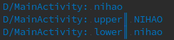
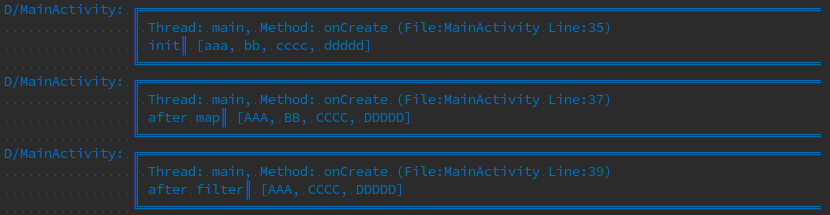
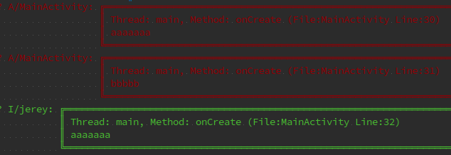

Klog - A Kotlin Log lib
---

### 简介 (what is Klog?)

Klog是用Kotlin所写的,利用其类扩展,实现了链式调用时,在不破坏其代码整体性的情况下,能够实现数据打印跟踪的log库.<br>

- 优点:<br>
1.链式打印<br>
2.自动识别调用方类名为TAG<br>
3.打印线程号,代码行 (默认不开启,需要开启请 `Klog.getSettings().setBorderEnable(true)`)<br>
- 缺点:<br>
 由于Kotlin对于伴生类方法的惰性加载优化, 在kt中调用可以使用 `Klog.d("hello")`,但是在java中,其使用的是内部类的方式实现惰性加载.<br>
 因此在java中, 调用方式变为了 `Klog.Companion.i("test");`<br>

*有更好的实现方式的欢迎pr or issues*

Download
------
project's build.gradle

``` gradle
  	allprojects {
  		repositories {
              ...
              maven { url 'https://jitpack.io' }
  		}
  	}
```

module's build.gradle (模块的build.gradle)

``` gradle
	dependencies {
	        compile 'com.github.Jerey-Jobs:Klog:v0.2'
	}
```


说明(Explanation)
------
无论什么语言, 程序员都需要输出log, Kotlin的语法扩展功能可为我们带来更新奇的输出log模式.

输出log的目的,无非两种情况<br>
1.用来表明程序执行到哪了<br>
2.打印数据处理前后的值<br>

那么Klog带来了数据边处理边打印的模式.

比如这种边处理字符串边打印的模式.
``` kotlin
    str.log()                   //直接输出该对象toString
       .toUpperCase()
       .log("upper")             //输出带提示的处理结果
       .toLowerCase()            //继续处理
       .log("lower")
```


又比如在lambda时,我们调试时需要跟踪数据被处理的情况

``` kotlin
    var list = arrayListOf<String>("aaa", "bb", "cccc", "ddddd")
    list.log("init")
        .map { it -> it.toUpperCase() }
        .log("after map")
        .filter { it -> it.length > 2 }
        .log("after filter")
```


又或者,我们需要直接打印

``` kotlin
    //修改Klog设置, 开启边框打印
    Klog.getSettings()
            .setBorderEnable(true)

    Klog.a("aaaaaaa")            //普通log输出方式1
    Klog.a(contents = "bbbbb")   //普通log输出方式2
    Klog.i("jerey", "aaaaaaa")    //带tag输出
```


so, Kotlin的类扩展为我们带来无限遐想


License
-----
```
Copyright 2017 Jerey-Jobs.

Licensed under the Apache License, Version 2.0 (the "License");
you may not use this file except in compliance with the License.
You may obtain a copy of the License at

   http://www.apache.org/licenses/LICENSE-2.0

Unless required by applicable law or agreed to in writing, software
distributed under the License is distributed on an "AS IS" BASIS,
WITHOUT WARRANTIES OR CONDITIONS OF ANY KIND, either express or implied.
See the License for the specific language governing permissions and
limitations under the License.
```
